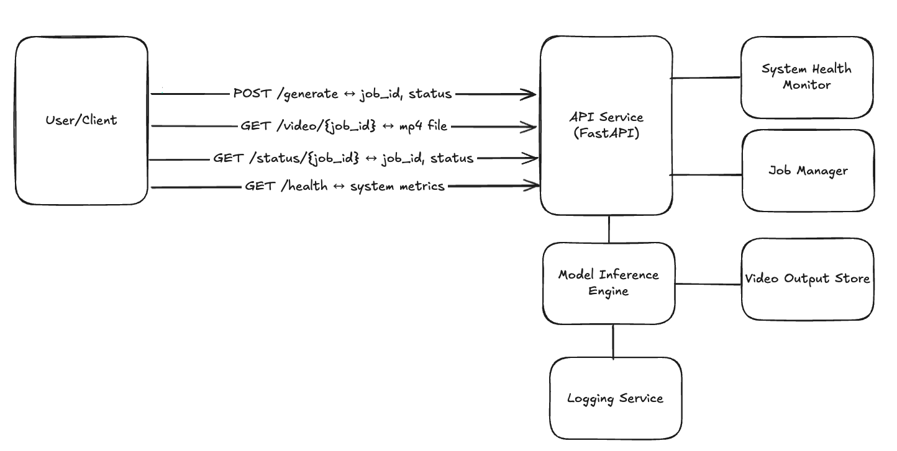

# Text-to-Video Generation Assignment

This repository contains a **production-ready API** for generating videos from text prompts using **Hugging Face’s CogVideoX model**.  
The service is designed to run on **H100 GPUs**, is fully **containerized with Docker**, and includes monitoring, logging, and error handling.

---

## Deliverables

This repository includes all required deliverables for the assignment:

1. **Source Code** – Complete, runnable code with clear structure (`app.py`, `Dockerfile`)  
2. **README.md** – Comprehensive setup and usage guide (this file)  
3. **API Documentation** – Endpoint specifications and examples (Swagger UI available at `/docs`)  
4. **Demo Script** – Simple script (below) showing end-to-end usage  

---

## Features
- **Text → Video Generation** using [CogVideoX-2B](https://huggingface.co/zai-org/CogVideoX-2b)  
- **REST API Endpoints** for:
  - Submitting jobs (`/generate`)
  - Checking job status (`/status/{job_id}`)
  - Downloading completed videos (`/video/{job_id}`)
  - Monitoring system health (`/health`)  
- **Containerized Deployment** with Docker (GPU-enabled)  
- **Logging** of all events (jobs, errors, GPU usage, system health)  
- **Optimized for H100 GPUs** with bfloat16 precision and CUDA acceleration  

---

## Project Structure
```

.
├── app.py           # Main FastAPI application
├── requirements.txt # Python dependencies
├── Dockerfile       # Containerization
├── output\_videos/   # Generated MP4s (created automatically)
├── logs/            # Application logs (created automatically)
├── docs/            # Documentation assets (e.g., diagram)
└── README.md        # Documentation

````

---

## System Architecture

The system is built around a modular design for reliability and maintainability.



- **User/Client**: Submits requests through REST endpoints  
- **FastAPI App** (`app.py`): Handles requests, responses, job management  
- **Job Store**: Tracks job states (pending/processing/completed/failed)  
- **CogVideoX Model**: HuggingFace text-to-video pipeline accelerated on GPU  
- **Output Videos**: Generated `.mp4` files  
- **Logs**: Structured logging for traceability and debugging  
- **System Health Monitor**: Reports CPU, RAM, and GPU usage  


---

## Installation (Local Setup)

### 1. Clone Repo
```bash
git clone https://github.com/your-username/video-gen-api.git
cd video-gen-api
````

### 2. Create Virtual Environment

```bash
python3 -m venv venv
source venv/bin/activate
```

### 3. Install Dependencies

```bash
pip install -r requirements.txt
```

### 4. Run the API

```bash
uvicorn app:app --host 0.0.0.0 --port 8000
```

Swagger UI available at: [http://localhost:8000/docs](http://localhost:8000/docs)

---

## Deployment with Docker

### Build Image

```bash
docker build -t video-gen-api .
```

### Run Container

```bash
docker run --gpus all -p 8000:8000 video-gen-api
```

* `--gpus all` ensures GPU acceleration on H100
* Accessible at [http://localhost:8000](http://localhost:8000)

---

## API Documentation

### **POST /generate**

Submit a video generation request.

Request:

```json
{
  "prompt": "A squirrel riding a skateboard in Times Square",
  "num_frames": 49,
  "guidance_scale": 4.5,
  "seed": 42,
  "fps": 12
}
```

Response:

```json
{
  "job_id": "job_20250914_121030",
  "status": "processing"
}
```

---

### **GET /status/{job\_id}**

Check job progress.

```json
{
  "job_id": "job_20250914_121030",
  "status": "completed"
}
```

---

### **GET /video/{job\_id}**

Retrieve completed `.mp4` file.
Returns binary video data (`video/mp4`).

---

### **GET /health**

System health metrics.

```json
{
  "cpu_usage": 12.5,
  "memory_usage": 43.1,
  "gpu_usage": 54.3,
  "active_jobs": 1,
  "completed_jobs": 2
}
```

---

## Demo Script (Simple End-to-End Usage)

To demonstrate how the API can be used end-to-end, below is a simple Python script.
This script:

1. Submits a generation job
2. Polls the job status until it completes
3. Downloads the generated video
4. Prints system health metrics

```python
import time
import requests

BASE_URL = "http://localhost:8000"  # Change if running remotely

def main():
    # 1. Submit a generation request
    payload = {
        "prompt": "A squirrel riding a skateboard in Times Square",
        "num_frames": 49,
        "guidance_scale": 4.5,
        "seed": 42,
        "fps": 12
    }
    print("[*] Submitting job...")
    resp = requests.post(f"{BASE_URL}/generate", json=payload)
    resp.raise_for_status()
    job = resp.json()
    job_id = job["job_id"]
    print(f"[+] Job submitted: {job_id}, status={job['status']}")

    # 2. Poll until job is completed
    while True:
        status_resp = requests.get(f"{BASE_URL}/status/{job_id}")
        status_resp.raise_for_status()
        status = status_resp.json()["status"]
        print(f"[*] Current status: {status}")
        if status == "completed":
            break
        if status == "failed":
            print("[!] Job failed.")
            return
        time.sleep(5)

    # 3. Retrieve video
    print("[*] Downloading video...")
    video_resp = requests.get(f"{BASE_URL}/video/{job_id}")
    if video_resp.status_code == 200:
        out_path = f"{job_id}.mp4"
        with open(out_path, "wb") as f:
            f.write(video_resp.content)
        print(f"[+] Video saved to {out_path}")
    else:
        print(f"[!] Could not download video: {video_resp.text}")

    # 4. Check system health
    print("[*] Checking system health...")
    health_resp = requests.get(f"{BASE_URL}/health")
    health_resp.raise_for_status()
    print("[+] System Health:", health_resp.json())

if __name__ == "__main__":
    main()
```

Run it with:

```bash
python demo.py
```

---

## Troubleshooting

* **API won’t start** → Check GPU drivers and CUDA installation (`nvidia-smi`)
* **Out of memory** → Lower `num_frames` or use smaller batch sizes
* **Docker GPU not detected** → Ensure NVIDIA Container Toolkit is installed (`--gpus all`)
* **Job stuck in processing** → Check logs in `logs/app_YYYYMMDD.log` for stack traces
* **Video not downloading** → Verify the job reached `COMPLETED` status before calling `/video/{job_id}`

---

## System Design Notes

* **Containerized** for reproducibility and portability
* **Error Handling** with structured logging for failed jobs
* **Monitoring** with `/health` endpoint for CPU, RAM, GPU metrics
* **Future Improvements**: persistent job store (Redis/Postgres), background workers (Celery/RQ), Kubernetes deployment manifests

---

## License

MIT License – Free to use and modify.

---

## Acknowledgements

* [Hugging Face Diffusers](https://huggingface.co/docs/diffusers/index)
* [FastAPI](https://fastapi.tiangolo.com/)
* [NVIDIA CUDA](https://developer.nvidia.com/cuda-toolkit)

```
